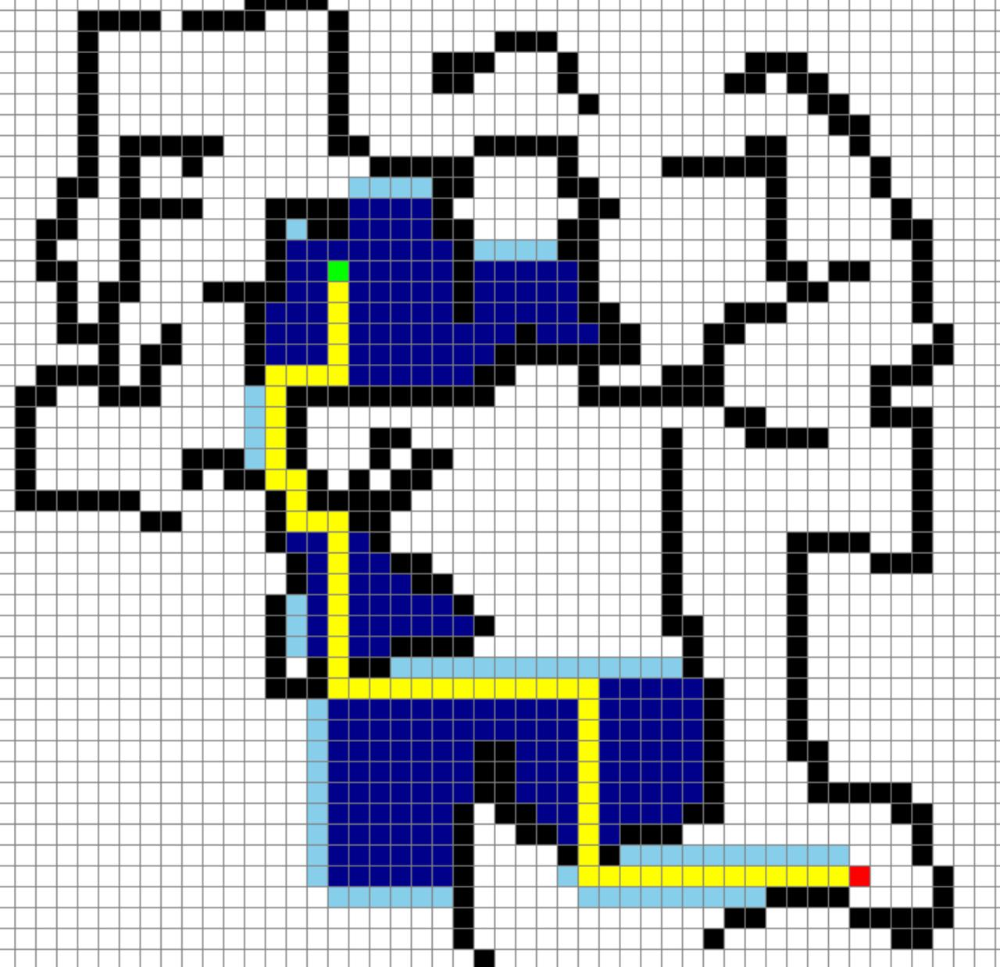

- Built an interactive tool using pygame that you can run locally to understand and play around with graph search algorithms
- Supports Depth-first, Breadth-first, Dijikastra, and A*
- From the grid, you can choose your starting and ending point and then select the cells where you want to add an obstruction, then click spacebar to run
 

 
<a href="https://github.com/Killshot667/graph-search-algorithms" class="btn btn-primary">CODE</a>

